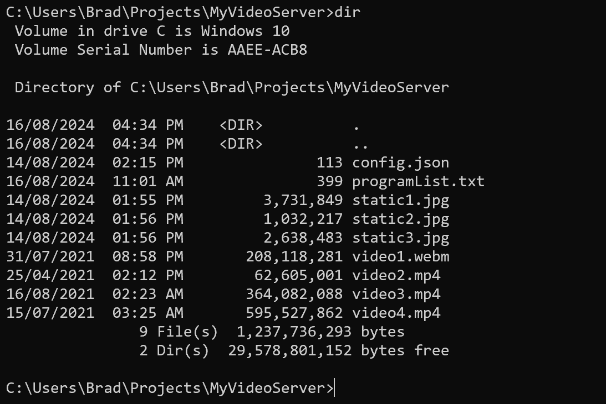
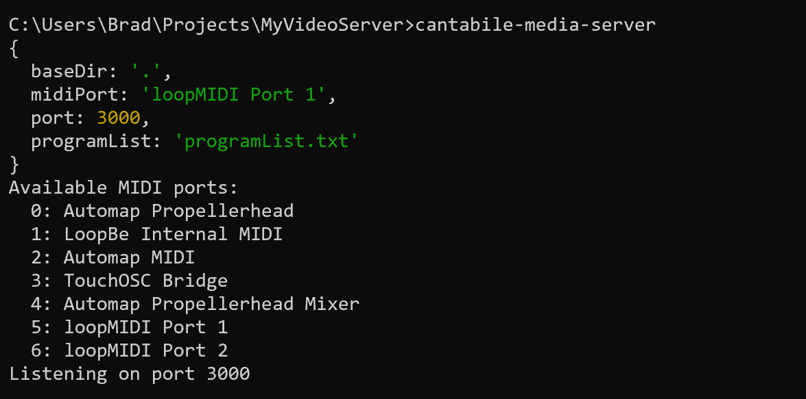
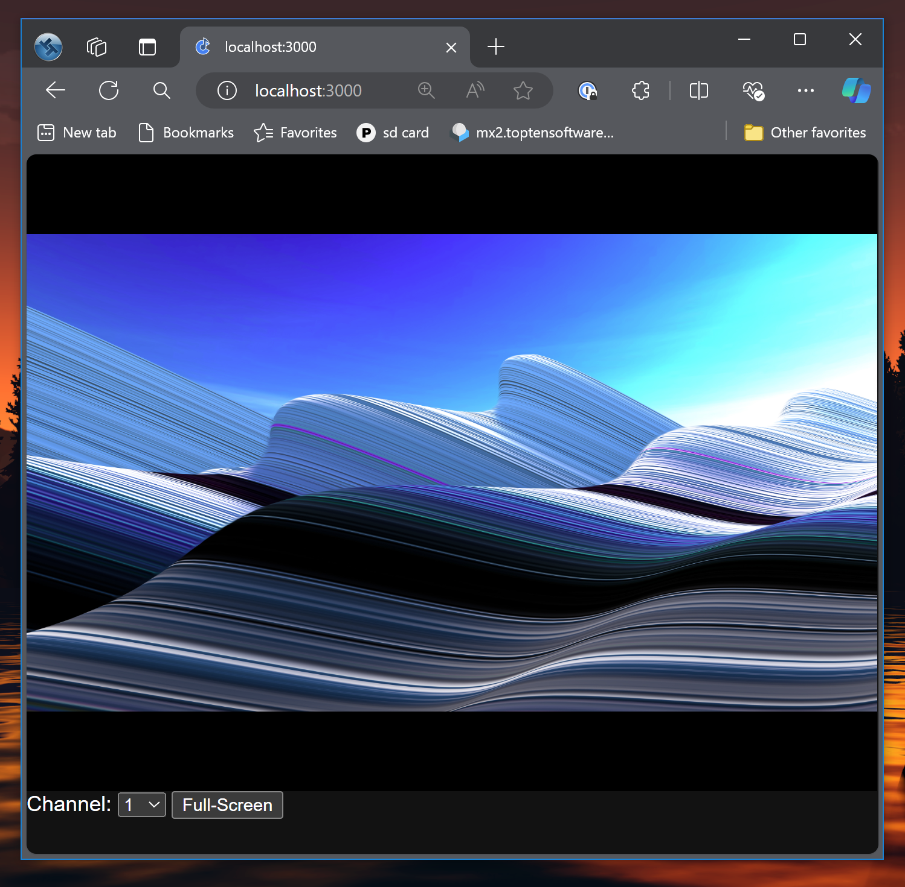

# Cantabile Media Server

Cantabile Media Server is MIDI controllable video playback, static image display and PDF viewer.

It's designed as an accompanying program for [Cantabile Live Performer Music Software](https://www.cantabilesoftware.com)
but should work with any MIDI Compatible software capable of sending MIDI events.


## Features

* Supports static images, videos, camera feeds and PDF documents
* Use MIDI to switch between images, videos, documents
* Use MIDI to start/stop video playback
* Use MIDI to scroll PDF documents
* Media content is displayed in a web browser allowing multiple remote displays across network
* Video playback is kept in sync across multiple remote clients
* MIDI Time Code (MTC) can be used to keep videos in sync. with an external time clock
* Supports 16 MIDI channels, each displaying different content (eg: video for audience, different PDF docs for band members)
* Real-time Camera feeds from WHEP compatible server
* Multiple layer support for overlaying different media content for fast switching by hiding/showing layers.


## Pre-requisites

This project assumes the user is reasonably technically competant, in particular with working with the system
command line and editing text files.


## Installation

To install:

1. Install [NodeJS](https://nodejs.org/en) (recommended v20.0 or later).
2. Install [Git](https://git-scm.com/downloads)
3. Install [GhostScript](https://ghostscript.com/releases/gsdnld.html) (optional, but required for PDF support)
4. From a command prompt install the cantabile-media-server package:

```
npm install -g github:toptensoftware/cantabile-media-server
```

(on non-Windows platforms may require `sudo`).

To update existing install, re-run the above command.

To uninstall:

```
npm uninstall -g cantabile-media-server
```


## Configuration

To setup the media server:

1. Create a directory to contain the various configuration and media files:

    ```
    $ mkdir MyMediaServer
    ```

2. In the created folder, create a file named `config.json` similar to that shown below.

    Replace the `midiPort` setting with the name of the MIDI port the server should listen on. To
    display a list of available MIDI ports run the command `cantabile-media-server --list-midi-devices`

    Adjust other settings as appropriate.

    ```
    {
        "baseDir": ".",
        "midiPort": "loopMIDI Port 1",
        "port": 3000,
        "programList": "programList.txt",
    }
    ```

3. In the same folder create the `programList.txt` similar to that shown below.

    This file maps MIDI program change events to specific video or static image files.

    ```
    # specifies the default for any programs not explicitly stated
    default: static1.jpg

    # specifies the base program number (0 or 1)
    base: 1

    # program number to media file mapping
    1: static1.jpg
    2: video2.mp4
    3: video3.mp4
    4: video4.mp4
    5: static2.jpg
    6: static3.jpg

    # WebRTC/WHEP realtime (camera) feeds are supported using webrtc+(url) format.  
    # Note: the URL must be the WHEP endpoint
    7: webrtc+http://localhost:8889/camera1/whep

    # program numbers can be in msb.lsb.pr format
    10.20.30: video1.webm

    # or bank.pr format
    234.10: video2.mp4

    ```

4. Place you video and image files in the same directory, like so:

    

5. Start the server by running the `cantabile-media-server` command. All going well you should see
   something like this:

    

6. Start a web-browser and navigate to the server's URL.  If you're on the same machine as the server
   is running, you can use `localhost:3000`:

   

7. Repeat step 6 for as many "video" displays as you need.

8. Send MIDI commands to the server to control media file selection and playback.


## Supported Media Files

All media files must be natively supported by the browser. [See here](https://www.geeksforgeeks.org/html5-video/) for a
list of video formats.

The follow should work: .png, .jpg, .jpeg, .gif, .webp, .mp4, .webm and .ogv

If your media is in a different format you'll need to manually convert.  For video files this can be easily 
done with [ffmpeg](https://ffmpeg.org/):

```
ffmpeg -i input.mpg output.mp4
```

## PDF Support

PDF files are supported if [Ghostscript](https://ghostscript.com/) is installed on the machine running the media server.

Usually the server can locate the Ghostscript executable automatically:

* On Windows, the C:\Program File\gs folder is searched for the most recent gswin64c.exe
* On other platforms, `gs` is assumed to be available on the system path.

The following settings in config.json can also be used to configure PDF rendering:

```
{
    ...
    gs_path: "C:\MyGhostScript\gs.exe",
    gs_resolution: 240,
    ...
}
```

The default rendering resolution is 180, which provides a good balance between speed/quality for most screen displays but
can be adjusted if required.

PDF files are displayed in the same way as any other media file by referencing the PDF file in the programList.txt file:

```
1: song1.pdf
2: song2.pdf
3: song3.pdf
```

PDF files can be scrolled via MIDI (see MIDI Implementation below).

Since PDF files are rendered on the server, if you reference a PDF file on a different machine the PDF file must
also be served by Cantabile Media Server.  For example, if a PDF file is reference using a full path like `http://someotherserver.lan/media/mysong.pdf` then `someotherserver.lan` must also running Cantabile Media Server.


## Time Synchronisation

Cantabile Media Server supports three time synchronization modes:

* `none` - each browser's video players maintains its own time which may drift or become very unsynchronized if started at different times
* `master` - the media server itself becomes the master time sync. source.
* `mtc` - the media server uses an external (ie: incoming) MIDI Time Code as the master time sync. source.

In `none` and `master` modes, playback is controlled by sending MMC Sys-ex Message for Play, Pause and Stop

In `mtc` modes, playback is started and stopped in response to MTC events received.

In `master` and `mtc` modes, periodic timestamp pings are sent to each connected client and the playback rate of the 
video players is constantly adjusted to keep the video as in-sync as possible.   If the discrepency between expected
time and actual time exceeds one second, the video instantly jumps to the expected timestamp and sync. resumes from 
that point onwards.

The default synchronization mode can be set for all video players in the main config file section, eg:

    ```
    {
        "baseDir": ".",
        "midiPort": "loopMIDI Port 1",
        "port": 3000,
        "programList": "programList.txt",
        "syncMode": "master",
    }
    ```

Each layer also has a customizable sync. mode - see Layers.


## Latency Compenstation

Each web browser client has a Latency Compenstation setting in the non-full screen Web UI.  When set to a non-zero 
value the time synchronization code will try to synchronize to a point that far into the future.  

This setting only takes effect when the video is actually playing and ignored when the video is stopped or paused.


## Layers

By default each channel supports a single "layer" of content.  For more complex setups you might like to create a
multi-layer configuration where multiple video/image layers are placed over each other and can be shown/hidden for
fast switching between different videos, images and camera feeds.

To set the layers for a channel, create a config file with "channels" and  "layers" sections like so:

```
{
    "baseDir": ".",
    "midiPort": "loopMIDI Port 1",
    "port": 3000,
    "programList": "programList.txt",
    "syncMode": "mtc",
    "channels": {
        "1": {
            "layers": [
                { 
                    "mediaFile": "band_logo.jpg" 
                },
                { 
                    "useProgramList": true,
                    "hiddenWhenStopped": true,
                },
                { 
                    "mediaFile": "webrtc+http://localhost:8889/mystream/whep",
                    "display": "hidden"
                }
            ]
        }
    }
}
```

The above example includes three layers:

* A background layer with a static image of the band logo
* A middle layer that shows the media file selected from the program list
* A top layer that's hidden by default but shows the real-time feed from a camera when shown

In this setup:

* By default, the band logo will be displayed
* If a program change causes a media file to be loaded for this channel, it will appear in place of the band logo
* MIDI commands can be used to arbitrarily unhide the camera feed.

Each layer supports the following settings:

* `mediaFile` - a media file to always show in this layer
* `display` - either 'visible' (the default if not specified), 'hidden' or 'inactive'
* `syncMode` - either 'none', 'master' or 'mtc' to set the sync mode for video's displayed in this layer.
* `useProgramList` - whether to load media from the program list (using the channel's selected program number)
* `programChannel` - specifies to use the selected program number from an alternate channel number
* `programSlot` - which program number slot to use (see Program Slots below)
* `programNumberOffset` - an offset to add to the channel's selected program number when loading media
* `hiddenWhenStopped` - if true, automatically hides the layer when the video is stopped (shown when playing or paused)


## Program Slots

Normally MIDI only supports a single program number selection per MIDI channel.  Since Cantabile Media Server supports
multiple display layers, sometimes you might want to select different media files on different layers.

To support this, each MIDI channel has 4 "program number slots".

* Program number slot 0 is the primary program number and is loaded by sending MIDI Program change events.
* MIDI CC's 70 - 73 are used to select program numbers for slots 0 to 3

(ie: program change and CC 70 are equivalent).

Notes: 

* all 4 program slots will use the standard MIDI program bank (MIDI CC's 0 and 32) at the time the program is loaded.  
    ie: to set a banked program number to a program slot first send the bank MSB/LSB then
send CC 70-73.
* CC's 70-73 refer to program slots 0-3  (not to layers 0-3). To have a layer use an alternative program number slot set the layer's `programSlot` setting (see above).
* when specifying program numbers using CCs 70-73 remember that the sent values must be zero based.
    ie: the first program is 0.  
    In contrast, many MIDI programs display program numbers as one-based so  the first program number
    is 1 (event though it's transmitted as value 0).  This means in the sending program, you may need to use one-based for program changes, and zero based for CC 70-73.


## Alternate Program Channels

Normally a display layer for a channel uses the selected MIDI program from the same channel.  Sometimes however you might
like to have separate display channels (ie: browser views) that all switch in response to a single program change.

The `programChannel` setting in a layer tells that layer to use the selected program number of a different channel.

In the following example, sending a MIDI program change on channel 1 will switch programs on both display channels 1 and 2.

```
    "channels": {
        "1": {
            "layers": [
                { 
                    "useProgramList": true,
                },
            ]
        },
        "2": {
            "layers": [
                { 
                    "useProgramList": true,
                    "programChannel: 1,                    <--- use the selected program of channel 1 instead of 2
                },
            ]
        }
    }
```

## Controlling Layer Visibility

Each layer has a visibility setting:

* `visible` - layer is active and shown (unless obscured by a higher level layer)
* `hidden` - layer is active (ie: loaded and maybe playing), but hidden allowing the next lower visible layer to be seen.
* `inactive` - layer is deactivated and hidden.

The visibility of a layer can be set in the config file, but can be changed on the fly using MIDI CCs 80 (layer 0) thru 
89 (layer 9) and sending the following values:

* 0 = inactive
* 1 = hidden
* any other value = visible


## MIDI Implementation

The server currently supports the following MIDI events:

* Program Bank Selection (CC 0 and CC 32)
* Program Change Events
* MMC Sys-ex Message for Play, Pause and Stop
* MIDI Time Code (MTC) to control playback and sync. video's configured with sync. mode 'mtc'
* CC 70 - 73 - program bank selection for alternate program slots 0 - 3
* CC 80 - 89 - controls visibility of layers 0 - 9.
* CC 90 - jump to marker (See MIDI Scroll Control below)
* CC 93 - invoke scroll command (See MIDI Scroll Control below)

The 16 MIDI channels are supported and each web browser can view a single "channel" (selectable by the drop down 
on the web page).

On receiving a program change event, the program number will be mapped to a media file as configured 
in `programList.txt`.  Any currently connected displays will be updated to the newly selected media file.

Send MMC Play, Pause and Stop events to control playback.  The device Id byte of the MMC message controls which
MIDI channel to play/stop.   0 = all channels. 1 = MIDI Channel 1, 2 = MIDI Channel 2 etc...


## MIDI Scroll Control

When displaying documents (currently on PDF files are supported) the document can be scrolled via MIDI control.

MIDI CC 90 jumps to a specified marker (for PDF files, each page is a marker so jumping to marker 0 jumps to the first page).

eg: Sending CC90 = 2 will jump to the third page (markers are zero based)

MIDI CC 93 accepts commands for various scroll operations and sending the following values will invoke the 
following actions:

* 1: line up
* 2: line down
* 3: half page up
* 4: half page down
* 5: page up
* 6: page down
* 7: home
* 8: end
* 9: previous marker
* 10: next marker

Note: 

* commands 1-8 cause the document to scroll by a factor of the screen size.
* commands 9-10 scroll to the next/previous marker (which for PDF documents is the next/previous PDF page).

eg: Sending CC93 = 2 will scroll the document down by 1 line (1/20 of the screen height)

eg: Sending CC93 = 6 will scroll the document down by the screen height

eg: Sending CC93 = 10 will scroll to the next PDF page


MIDI Scroll Control is directed to the top-most layer that supports it and will be ignored by other layers.


## Running Across Multiple Machines

The server can be configured to run across multiple machines:

* The server itself can be moved from the MIDI sending machine using MIDI software like rtpMIDI.
* The server can be configured to only serve media and not be MIDI controllable by omitting the MIDI port
  setting in `config.json`.  This can be used to create a separate media only server from which to 
  source media files.
* The program list can reference non-locally served files by prefixing the media file with `http://`


## Camera/Real-time Feeds

WebRTC feeds with a correct WHEP implementation are supported for real-time camera feeds.

To indicate to Cantabile Media Server that a URL represents a webrtc feed prefix the
full WHEP endpoint url with webrtc+(url).

eg: suppose your realtime feed's WHEP end point is 

```http://localhost:8889/camera1/whep```

then full URL to be used in programList.txt would be 

```webrtc+http://localhost:8889/camera1/whep```

This is known to work with [mediamtx](https://github.com/bluenviron/mediamtx).

It currently does _not_ work with [go2rtc](https://github.com/AlexxIT/go2rtc) due to an
incomplete WHEP implementation.  Hopefully this will be rectified soon - [see here](https://github.com/AlexxIT/go2rtc/issues/1315).


## Command Line

Cantabile Media Server commands supports the following command line arguments:

```
Usage: cantabile-media-server [options]

Options:
   --list-midi-devices      Shows a list of available midi devices
   --watch                  Watch and automatically reload program list file when changed
   --verbose                Shows more logging
   --help                   Shows this help
   --version                Shows version info
```